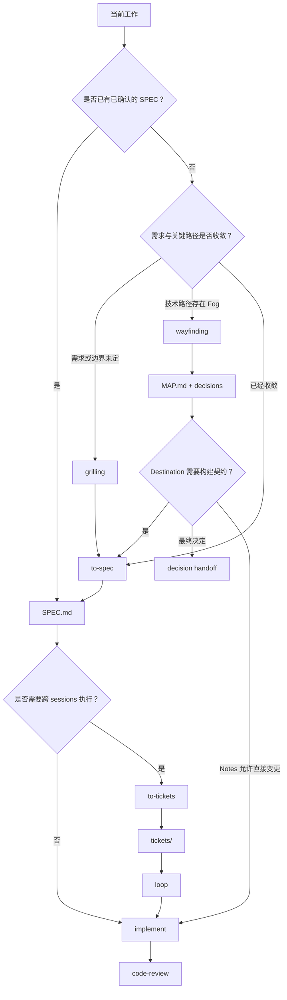
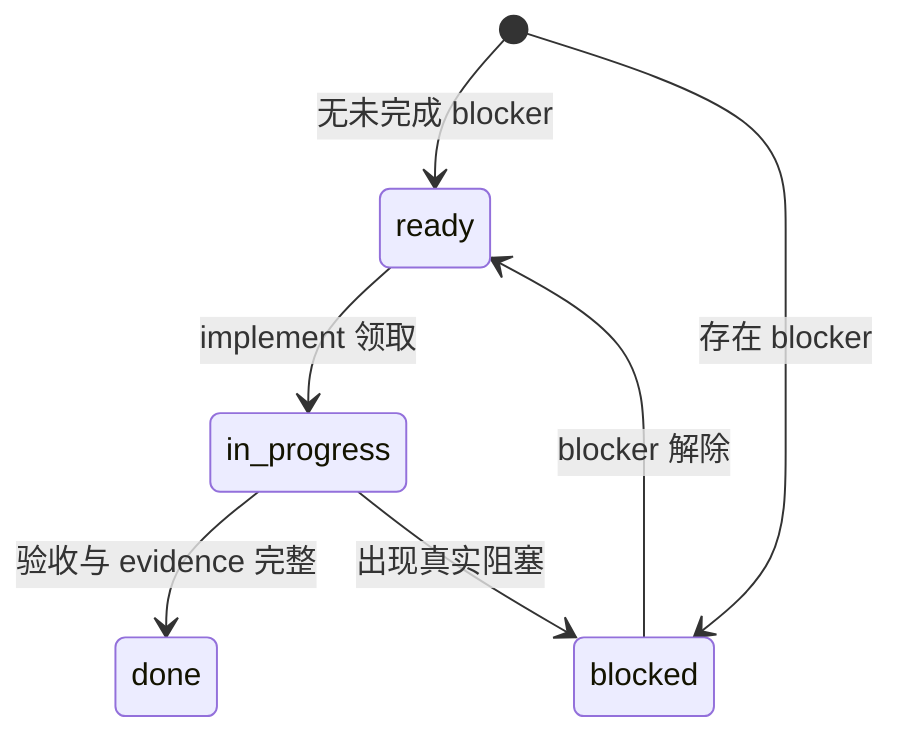

# Agent Skills

个人 Agent skills 集合。

## 目录

- `global/`：来自全局 `~/.agents/skills`，提供工具、文档、委托和通用工作流。
- `engineering/`：通用工程 Coding 流程，不绑定具体框架、项目目录、业务组件或 Agent Runtime。

## Global Skills

| Skill | 用途 |
| --- | --- |
| [`claude-coder`](./global/claude-coder/SKILL.md) | 将明确的编码、修复、重构或测试任务委托给 Claude Code。 |
| [`codex-executor`](./global/codex-executor/SKILL.md) | 将边界清晰的编码任务委托给 Codex CLI 子智能体执行。 |
| [`find-docs`](./global/find-docs/SKILL.md) | 查询开发技术、库、SDK 和 CLI 的最新文档。 |
| [`fuck-my-shit-mountain`](./global/fuck-my-shit-mountain/SKILL.md) | 对项目进行证据驱动的全面工程审计。 |
| [`handoff`](./global/handoff/SKILL.md) | 将当前任务整理为可供下一次会话接续的交接文档。 |
| [`humanizer-zh`](./global/humanizer-zh/SKILL.md) | 清理中文文本中的 AI 味、翻译腔和模板化表达。 |
| [`kimi-worker`](./global/kimi-worker/SKILL.md) | 将明确的编码任务委托给 Kimi CLI。 |
| [`pi-agent`](./global/pi-agent/SKILL.md) | 使用 Pi CLI 获取第二意见、委员会审查或执行受限实现。 |
| [`prompt-optimizer`](./global/prompt-optimizer/SKILL.md) | 优化任务提示词的目标、上下文、边界、输出和验证条件。 |
| [`resolving-merge-conflicts`](./global/resolving-merge-conflicts/SKILL.md) | 调查并解决 Git merge/rebase 冲突。 |
| [`tavily-best-practices`](./global/tavily-best-practices/SKILL.md) | 设计 Tavily 搜索、提取、爬取和研究集成。 |
| [`tavily-cli`](./global/tavily-cli/SKILL.md) | 通过 Tavily CLI 进行网页搜索、提取、爬取和研究。 |
| [`tavily-crawl`](./global/tavily-crawl/SKILL.md) | 批量爬取网站并提取多个页面内容。 |
| [`tavily-dynamic-search`](./global/tavily-dynamic-search/SKILL.md) | 编程式筛选网页搜索结果，减少无关上下文。 |
| [`tavily-extract`](./global/tavily-extract/SKILL.md) | 从指定 URL 提取干净的 Markdown 或文本。 |
| [`tavily-map`](./global/tavily-map/SKILL.md) | 发现网站 URL 结构，不提取页面正文。 |
| [`tavily-research`](./global/tavily-research/SKILL.md) | 基于多来源开展带引用的深度研究。 |
| [`tavily-search`](./global/tavily-search/SKILL.md) | 获取面向 Agent 优化的网页搜索结果。 |
| [`teach`](./global/teach/SKILL.md) | 在工作区内组织连续的主题学习、参考资料和学习记录。 |
| [`url-to-markdown`](./global/url-to-markdown/SKILL.md) | 将公开网页转换为本地 Markdown 文件。 |

## Engineering Skills

> 本仓库的工程方案以 Matt Pocock 的 [skills](https://github.com/mattpocock/skills) 为行为基线，并针对本地 artifact、Agent Runtime、dirty worktree 和显式 Git 授权做了适配，不是逐行翻译。

Engineering skills 不是完整的软件开发框架，也不会接管项目流程。它们把可以跨语言、跨框架复用的软件工程方法拆成独立、可组合的 Agent Skills。

### 设计原则

- **通用优先**：不绑定语言、框架、目录结构、业务组件或 Agent Runtime。
- **项目规则外置**：coding standards、架构约束、领域术语、ADR、Git 规则和测试约定属于目标仓库，而不是 Skill。
- **单一职责**：每个 Skill 解决一种明确的工程问题，避免把完整生命周期塞进一个巨型 prompt。
- **可组合**：workflow 可以调用 engineering discipline，但不复制其规则。每类规则只保留一个 owner。
- **证据驱动**：代码事实、spec、测试、运行结果和 review evidence 优先于模型自报。
- **渐进式上下文**：只读取当前任务需要的项目上下文，不假定固定 `docs/**` 路径，也不预加载整套项目知识。
- **可选项目配置**：`project-setup` 可以把已确认的稳定入口写入项目 `AGENTS.md`。未配置的项目继续动态发现，不以 setup 作为使用前置条件。
- **状态职责分离**：Runtime 负责 conversation、session、context recovery 和 interruption persistence；Engineering Skills 只维护规范、execution graph、交付进度与 evidence。

使用时按以下优先级发现项目上下文：

1. 用户明确要求和当前任务约束。
2. 仓库级 Agent 指令与项目文档。
3. 已存在的 coding standards、架构文档、ADR、领域词汇、测试与构建配置。
4. 当前代码、调用链和可运行验证所证明的事实。

项目使用 `project-setup` 后，各 Skill 按“当前用户指定、适用 `AGENTS.md` Profile、仓库已有结构、通用默认行为、仍有歧义时询问”的顺序解析约定。Profile 只保存稳定入口和策略，不保存运行进度或具体任务状态。

### Skill 类型

| 类型 | Skill | 职责 |
| --- | --- | --- |
| Project Setup | `project-setup` | 检测现有项目结构，一次性建议并持久化可选的 Engineering Skills Profile。 |
| Workflow | `grilling`, `to-spec`, `to-tickets`, `implement`, `wayfinding` | 组织需求澄清、规格化、ticket 拆分、实现或长期探索阶段。 |
| Engineering Discipline | `tdd`, `codebase-design`, `domain-modeling`, `code-review`, `debug`, `simplify`, `review-architecture`, `improve-codebase-architecture` | 提供可复用的软件工程判断与实践。 |
| Execution Protocol | `loop` | 消费任务契约或 ticket graph，负责 ready frontier、调度、progress、evidence、iteration / retry 和 no-progress 规则。 |

### 如何选择 Skill

先判断是否真的需要 Skill。以下任务通常直接处理即可：

- 明确的一行或局部修改。
- 简单配置调整。
- 明确且低风险的机械性修改。
- 只需要查询事实或阅读代码。
- 已经有清晰反馈循环、不需要额外工程方法的任务。

只有当 Skill 能明显降低不确定性、错误率或长期维护成本时再使用。需要使用时，先选择当前阶段的主 Workflow，再按具体工程问题叠加 Engineering Discipline；Project Setup 和 Execution Protocol 不属于主流程阶段。

#### 选择主 Workflow

Workflow 决定当前阶段及其交付物。不要机械地从第一个 Skill 开始，应根据尚未解决的不确定性和已有 artifact 选择入口。

| 当前状态 | 入口 | 产出或结果 |
| --- | --- | --- |
| 产品行为、边界或验收尚未收敛 | `grilling` | 已确认的需求与决策，以及同步更新的领域术语/必要 ADR |
| 目标明确，但关键技术路径存在 Fog of war，且需要跨 session 探索 | `wayfinding` | `MAP.md` 与 `decisions/` |
| 需求或 Map 已收敛，需要形成规范契约 | `to-spec` | `SPEC.md` |
| 已有 SPEC，但需要拆成多个可独立领取的执行单元 | `to-tickets` | `tickets/*.md` |
| 实现边界明确，可以开始交付代码 | `implement` | 已实现并验证的变更 |

`grilling` 解决“需求或决策未定”，并在同一 Design Tree 中编排 `domain-modeling`，不另开第二套访谈。`wayfinding` 解决“目标大体明确，但技术路线仍需持续探索”。是否拆 ticket 取决于工作能否由一个 fresh session 可靠完成，以及是否存在独立交付和真实 blocker，而不只取决于任务大小。

#### 按需叠加 Engineering Discipline

Engineering Discipline 提供某个阶段需要的工程判断，可以与 Workflow 或其他 Discipline 组合，不是互斥入口。

| 工程问题 | Discipline |
| --- | --- |
| 已确认存在 bug，需要复现并定位根因 | `debug` |
| 需要判断当前架构是否合理 | `review-architecture` |
| 需要主动寻找 deepening 候选并推进目标设计 | `improve-codebase-architecture` |
| 需要设计目标 Module、Interface、Seam、Adapter 或依赖边界 | `codebase-design` |
| 需要统一领域术语，或判断是否记录长期架构决策 | `domain-modeling` |
| 需要通过 test-first / red-green 驱动行为实现 | `tdd` |
| 需要证明并删除没有生产 ownership 的维护义务 | `simplify` |
| 变更已经完成，需要检查项目规范和需求契约 | `code-review` |

#### 项目配置与执行控制

| 能力 | 何时使用 |
| --- | --- |
| `project-setup` | 希望把稳定的项目上下文入口和 Engineering Skills Profile 写入 `AGENTS.md` 时，可选使用 |
| Runtime continuation | conversation、session、context recovery 或 interruption persistence 需要由当前 Agent Runtime 维护时使用 |
| `loop` | 已有明确任务契约，需要持续计算 frontier、调度执行单元、聚合 evidence 并判断 progress 时使用 |

`loop` 不是普通重试器，也不管理 conversation 或 session 生命周期。Runtime continuation state 与 ticket delivery state 相互独立；Loop 只依据任务契约和 execution evidence 推进工程工作。

```text
Runtime
    └── conversation / session / context recovery / interruption

Engineering workflow
    SPEC.md
       │
    tickets/
       │
      loop
       │  frontier / scheduling / progress / evidence
       ▼
   implement
```

进入某个 Skill 后，具体触发条件、边界和停止条件仍以对应的 `SKILL.md` 为准。

### Artifact 与主工作流

长任务不能依赖 session 自动延续上下文，多轮压缩之后就会产生幻觉或者降智了。这套 workflow 使用职责单一、可回读的本地 artifact 交接信息，下游环节不应重新猜测或静默改写上游结论。

| 层次 | Artifact | Owner | 它回答的问题 | 不应承担的职责 |
| --- | --- | --- | --- | --- |
| 决策探索 | `MAP.md` + `decisions/` | `wayfinding` | 路线不清楚时，哪些事实和选择必须先解决？ | 直接描述实现步骤或交付代码 |
| 规范契约 | `SPEC.md` | `to-spec` | 最终要构建什么、范围是什么、如何验收？ | ticket 拆分、进度或 retry 状态 |
| 执行图 | `tickets/*.md` | `to-tickets` | 工作如何拆成独立 session、哪些 ticket 真正互相阻塞？ | 改写 SPEC 的需求或验收 |
| 执行证据 | ticket 状态、验收勾选、receipt | `implement`、`loop` | 当前做到哪里、下一步能做什么、依据是什么？ | 改写决策、范围、需求契约或 Runtime continuation state |

`SPEC.md` 是唯一的规范性需求来源，`tickets/` 是唯一的 execution graph。`wayfinding` 的 decision ticket 与 `to-tickets` 的 delivery ticket 不是一类工作，前者解决“应该如何决定”，后者交付“已经决定的行为”，两者之间必须经过 `to-spec`，由 SPEC 把分散结论压缩成可构建的单一契约。

Runtime continuation state 不属于 execution graph，不能替代 ticket Status、acceptance evidence 或 ready frontier。



### 本地 ticket 生命周期

`to-tickets` 在 `SPEC.md` 同级创建 `tickets/`。每张 ticket 都是一个可独立验收的 vertical slice，其中包含 `Specification` 链接、`What to build`、`Constraints`、`Acceptance criteria`、`Blocked by` 和 `Status`。没有 blocker 的 ticket 初始为 `ready`；存在未完成 blocker 的 ticket 初始为 `blocked`。



执行时，`loop` 只维护 dependency-derived 的 `blocked → ready`；`implement` 负责 `ready → in-progress → done/blocked`、验收勾选和 evidence。二者都不能为了继续实现而改写 `What to build`、`Constraints`、`Acceptance criteria` 或 `Blocked by`。这些内容需要变化时，应回到 `grilling` 或 `wayfinding`，再通过 `to-spec` 和 `to-tickets` 更新下游 artifact。

### 执行约束

1. 先读取用户要求、目标项目的 `AGENTS.md`、现有规范、ADR、领域词汇、测试与构建配置。
2. 只由对应 owner 修改其 artifact；下游 Skill 不静默改写上游结论。
3. Ticket 模式默认串行调度一张 `ready` ticket，并由独立 `implement` 执行；只有能证明 tickets 与 writable surfaces 足够隔离时才并行，独立 worktree 仅在隔离确有需要时使用。
4. 根据风险选择测试、构建、运行或审查，并记录可复查的 evidence。
5. 执行中出现新的产品、协议、边界或验收选择时，停止猜测并回到决策或规范阶段。
6. Commit、push、建分支等版本控制写操作始终需要用户明确授权。

### 典型组合

这些组合用于说明不同类型的 Skill 如何协作，不是强制生命周期。

| 场景 | 典型组合 |
| --- | --- |
| 普通行为实现 | `implement` + `tdd` → `code-review` |
| Bug 修复 | `debug` → reproduction → root cause → regression test → fix |
| 架构治理 | `review-architecture` → `codebase-design` → `to-spec` → `implement` |
| 主动深化 Module | `improve-codebase-architecture` → `grilling` → `to-spec` → `implement` |
| 长期复杂度治理 | `simplify Survey` → evidence → `simplify Change` → verification |

长期复杂度治理针对“为了验证 AI 写得对不对而逐渐进入生产代码”的 abstraction、injection point、wrapper、hook、debug state、compatibility path 和实验残留。重点不是识别 AI 作者，而是判断这些维护义务是否仍有真实生产 ownership。

### Skills 一览

#### Project Setup

| Skill | 用途 |
| --- | --- |
| [`project-setup`](./engineering/project-setup/SKILL.md) | 配置工作流、领域文档、Runtime 状态与可选 issue tracker/triage 入口。 |

#### Workflow

| Skill | 用途 |
| --- | --- |
| [`grilling`](./engineering/grilling/SKILL.md) | 通过统一 Design Tree 收敛决策，并由 domain-modeling discipline 同步维护领域术语与必要 ADR。 |
| [`wayfinding`](./engineering/wayfinding/SKILL.md) | 对不确定技术领域进行跨会话探索，维护地图和决策记录。 |
| [`to-spec`](./engineering/to-spec/SKILL.md) | 将已收敛需求或完成的 Map 落盘为规范性 `SPEC.md`。 |
| [`to-tickets`](./engineering/to-tickets/SKILL.md) | 将已确认的 `SPEC.md` 拆成带真实 blocker 的本地 vertical-slice tickets。 |
| [`implement`](./engineering/implement/SKILL.md) | 按已确认的需求契约实现、验证和审查任务。 |

#### Engineering Discipline

| Skill | 用途 |
| --- | --- |
| [`debug`](./engineering/debug/SKILL.md) | 基于复现证据定位并修复 bug、性能回归和不稳定行为。 |
| [`review-architecture`](./engineering/review-architecture/SKILL.md) | 评审现有架构是否合理、是否符合项目约束与相关技术栈最佳实践，并输出有证据支撑的 findings。 |
| [`improve-codebase-architecture`](./engineering/improve-codebase-architecture/SKILL.md) | 扫描 deepening 候选，生成可视化报告，并在用户选择后推进目标设计。 |
| [`codebase-design`](./engineering/codebase-design/SKILL.md) | 设计和评估 Module、Interface、Seam、Adapter 与依赖边界。 |
| [`domain-modeling`](./engineering/domain-modeling/SKILL.md) | 统一领域术语，并在满足条件时记录长期架构决策。 |
| [`tdd`](./engineering/tdd/SKILL.md) | 使用 red-green 的 vertical-slice 循环，通过公开 Seam 验证行为。 |
| [`simplify`](./engineering/simplify/SKILL.md) | 在行为不变前提下删除没有当前生产 ownership 的偶然复杂度。 |
| [`code-review`](./engineering/code-review/SKILL.md) | 分别从规范和需求两个轴审查已完成的代码改动。 |

#### Execution Protocol

| Skill | 用途 |
| --- | --- |
| [`loop`](./engineering/loop/SKILL.md) | 维护 ready frontier，调度 `implement` 执行单元，并依据 evidence 判断 progress、继续与稳定停止。 |

## 使用

按需将目标 Skill 目录复制到 Agent 客户端的 skills 目录，Skill 内的脚本、参考文档和模板随目录一起使用。README 说明 **What / Why / When / How they compose**，具体执行规则以各自 `SKILL.md` 为准。
