# Agent Skills

个人 Agent skills 集合。

## 目录

- `global/`：来自全局 `~/.agents/skills`，提供工具、文档、委托和通用工作流。
- `engineering/`：通用工程 Coding 流程，不绑定具体框架、项目目录、业务组件或 Agent Runtime。

## Global Skills

| Skill | 用途 |
| --- | --- |
| [`claude-coder`](./global/claude-coder/SKILL.md) | 将明确的编码、修复、重构或测试任务委托给 Claude Code。 |
| [`codex-executor`](./global/codex-executor/SKILL.md) | 将边界清晰的编码任务委托给 Codex CLI 子智能体执行。 |
| [`find-docs`](./global/find-docs/SKILL.md) | 查询开发技术、库、SDK 和 CLI 的最新文档。 |
| [`fuck-my-shit-mountain`](./global/fuck-my-shit-mountain/SKILL.md) | 对项目进行证据驱动的全面工程审计。 |
| [`handoff`](./global/handoff/SKILL.md) | 将当前任务整理为可供下一次会话接续的交接文档。 |
| [`humanizer-zh`](./global/humanizer-zh/SKILL.md) | 清理中文文本中的 AI 味、翻译腔和模板化表达。 |
| [`kimi-worker`](./global/kimi-worker/SKILL.md) | 将明确的编码任务委托给 Kimi CLI。 |
| [`pi-agent`](./global/pi-agent/SKILL.md) | 使用 Pi CLI 获取第二意见、委员会审查或执行受限实现。 |
| [`prompt-optimizer`](./global/prompt-optimizer/SKILL.md) | 优化任务提示词的目标、上下文、边界、输出和验证条件。 |
| [`resolving-merge-conflicts`](./global/resolving-merge-conflicts/SKILL.md) | 调查并解决 Git merge/rebase 冲突。 |
| [`tavily-best-practices`](./global/tavily-best-practices/SKILL.md) | 设计 Tavily 搜索、提取、爬取和研究集成。 |
| [`tavily-cli`](./global/tavily-cli/SKILL.md) | 通过 Tavily CLI 进行网页搜索、提取、爬取和研究。 |
| [`tavily-crawl`](./global/tavily-crawl/SKILL.md) | 批量爬取网站并提取多个页面内容。 |
| [`tavily-dynamic-search`](./global/tavily-dynamic-search/SKILL.md) | 编程式筛选网页搜索结果，减少无关上下文。 |
| [`tavily-extract`](./global/tavily-extract/SKILL.md) | 从指定 URL 提取干净的 Markdown 或文本。 |
| [`tavily-map`](./global/tavily-map/SKILL.md) | 发现网站 URL 结构，不提取页面正文。 |
| [`tavily-research`](./global/tavily-research/SKILL.md) | 基于多来源开展带引用的深度研究。 |
| [`tavily-search`](./global/tavily-search/SKILL.md) | 获取面向 Agent 优化的网页搜索结果。 |
| [`teach`](./global/teach/SKILL.md) | 在工作区内组织连续的主题学习、参考资料和学习记录。 |
| [`url-to-markdown`](./global/url-to-markdown/SKILL.md) | 将公开网页转换为本地 Markdown 文件。 |
| [`zh-terminology`](./global/zh-terminology/SKILL.md) | 按语境审校中文术语，避免英语硬翻译并同步多载体表达。 |

## Engineering Skills

> 本仓库的工程方案以 Matt Pocock 的 [skills](https://github.com/mattpocock/skills) 为行为基线，并针对本地产物、Agent Runtime、dirty worktree 和显式 Git 授权做了适配，不是逐行翻译。

Engineering skills 不是完整的软件开发框架，也不会接管项目流程。它们把可以跨语言、跨框架复用的软件工程方法拆成独立、可组合的 Agent Skills。

### 设计原则

- **通用优先**：不绑定语言、框架、目录结构、业务组件或 Agent Runtime。
- **项目规则外置**：coding standards、架构约束、领域术语、ADR、Git 规则和测试约定属于目标仓库，而不是 Skill。
- **单一职责**：每个 Skill 解决一种明确的工程问题，避免把完整生命周期塞进一个巨型 prompt。
- **可组合**：workflow 可以调用 engineering discipline，但不复制其规则。每类规则只保留一个 owner。
- **证据驱动**：代码事实、spec、测试、运行结果和 review evidence 优先于模型自报。
- **渐进式上下文**：只读取当前任务需要的项目上下文，不假定固定 `docs/**` 路径，也不预加载整套项目知识。
- **可选项目配置**：`project-setup` 可以把已确认的稳定入口写入项目 `AGENTS.md`。未配置的项目继续动态发现，不以 setup 作为使用前置条件。
- **状态职责分离**：Runtime 负责 conversation、session、context recovery 和 interruption persistence；Engineering Skills 只维护规范、执行图、交付进度与 evidence。

使用时按以下优先级发现项目上下文：

1. 用户明确要求和当前任务约束。
2. 仓库级 Agent 指令与项目文档。
3. 已存在的 coding standards、架构文档、ADR、领域词汇、测试与构建配置。
4. 当前代码、调用链和可运行验证所证明的事实。

项目使用 `project-setup` 后，各 Skill 按“当前用户指定、适用 `AGENTS.md` Profile、仓库已有结构、通用默认行为、仍有歧义时询问”的顺序解析约定。Profile 只保存稳定入口和策略，不保存运行进度或具体任务状态。

### Skill 类型

| 类型 | Skill | 职责 |
| --- | --- | --- |
| Project Setup | `project-setup` | 检测现有项目结构，一次性建议并持久化需求权威、上下文与协作入口。 |
| Workflow | `grilling`, `wayfinding`, `to-spec`, `high-level-design`, `to-tickets`, `quick-implement` | 组织需求澄清、规格化、按需概要设计、ticket 拆分和单次实现。 |
| Engineering Discipline | `tdd`, `codebase-design`, `domain-modeling`, `code-review`, `debug`, `simplify`, `review-architecture`, `improve-codebase-architecture` | 提供可复用的软件工程判断与实践。 |
| Execution Protocol | `loop` | 消费 ticket 执行图，负责当前可执行任务、工作单元执行、progress、evidence、整体交付审查、iteration / retry 和 no-progress 规则。 |

### 如何选择 Skill

先判断是否真的需要 Skill。以下任务通常直接处理即可：

- 明确的一行或局部修改。
- 简单配置调整。
- 明确且低风险的机械性修改。
- 只需要查询事实或阅读代码。
- 已经有清晰反馈循环、不需要额外工程方法的任务。

只有当 Skill 能明显降低不确定性、错误率或长期维护成本时再使用。需要使用时，先选择当前阶段的主 Workflow，再按具体工程问题叠加 Engineering Discipline；Project Setup 和 Execution Protocol 不属于主流程阶段。

#### 选择主 Workflow

Workflow 决定当前阶段及其交付物。不要机械地从第一个 Skill 开始，应根据尚未解决的不确定性和已有产物选择入口。

| 当前状态 | 入口 | 产出或结果 |
| --- | --- | --- |
| 产品行为、边界或验收尚未收敛 | `grilling` | 已确认的需求与决策，以及同步更新的领域术语/必要 ADR |
| 目标明确，但关键技术路径仍存在技术迷雾，且需要跨会话探索 | `wayfinding` | `MAP.md` 与 `decisions/` |
| 需求或 Map 已收敛，或已有 SPEC 需要吸收需求变更 | `to-spec` | 创建或修订同一份 `SPEC.md` |
| 已确认 SPEC 存在多处实现需要共同遵守的设计约定，需要概要设计或修订 | `high-level-design` | 创建或修订同一份 `HLD.md` |
| 已有 SPEC 与适用 HLD，但需要拆成多个可独立领取的执行单元 | `to-tickets` | `tickets/*.md` |
| 已有无需执行图的单一 SPEC | `quick-implement` | 已实现、验证并审查的单次交付 |

`grilling` 解决“需求或决策未定”，并在同一 Design Tree 中编排 `domain-modeling`，不另开第二套访谈。`wayfinding` 解决“目标大体明确，但技术路线仍需持续探索”。`to-spec` 只建立需求规范并分别判断概要设计路径与执行路径：多处实现需要共同遵守设计约束时先进入 `high-level-design`；ticket 数量不是 HLD 条件。HLD 主动搜索当前代码库的相似实现、调用方和架构约束，优先 `Reuse` / `Extend`，只有现有结构无法满足 SPEC 时才采用 `New` / `Replace`。单一范围任务交给 `quick-implement`；需要多个实现任务、依赖关系或统一调度时，由 `to-tickets` 创建执行图。只要执行图已经存在，无论一张还是多张 active ticket，都由 `loop` 执行。

#### 按需叠加 Engineering Discipline

Engineering Discipline 提供某个阶段需要的工程判断，可以与 Workflow 或其他 Discipline 组合，不是互斥入口。

| 工程问题 | Discipline |
| --- | --- |
| 已确认存在 bug，需要复现并定位根因 | `debug` |
| 需要判断当前架构是否合理 | `review-architecture` |
| 需要主动寻找 deepening 候选并推进目标设计 | `improve-codebase-architecture` |
| 需要设计目标 Module、Interface、Seam、Adapter 或依赖边界 | `codebase-design` |
| 需要统一领域术语，或判断是否记录长期架构决策 | `domain-modeling` |
| 需要通过 test-first / red-green 驱动行为实现 | `tdd` |
| 需要证明并删除没有生产职责的维护义务 | `simplify` |
| 变更已经完成，需要检查项目规范、需求契约和适用概要设计 | `code-review` |

#### 项目配置与执行控制

| 能力 | 何时使用 |
| --- | --- |
| `project-setup` | 希望把稳定的需求权威模式、项目上下文入口和 Engineering Skills Profile 写入 `AGENTS.md` 时，可选使用 |
| `loop` | 已有 ticket 执行图，需要持续确定当前可执行任务、执行工作单元、聚合证据，并在完成前执行整体交付审查时使用 |

`loop` 不是普通重试器，也不管理 conversation 或 session 生命周期。运行时上下文续接状态与 ticket 交付状态相互独立。

`quick-implement` 负责无需 graph 的单次 SPEC 实现。`loop` 是 ticket graph 在正常执行期间的唯一写入者，并按自包含的内部 `references/ticket-worker.md` 协议执行每张 ticket；worker 不作为独立 Skill 暴露，也不修改 graph。当前 workspace 由调用方或 Agent Runtime 提供，Engineering Skills 不创建、切换或管理执行环境。

```text
Runtime
    └── conversation / session / context recovery / interruption

Engineering workflow
    SPEC.md
       │
    HLD.md (when required)
       │
    tickets/
       │
      loop
       │  frontier / status / evidence
       ▼
 ticket-worker
```

进入某个 Skill 后，具体触发条件、边界和停止条件仍以对应的 `SKILL.md` 为准。

### 产物与主工作流

长任务不能依赖 session 自动延续上下文，多轮压缩之后就会产生幻觉或者降智了。这套 workflow 使用职责单一、可回读的本地产物交接信息，下游环节不应重新猜测或静默改写上游结论。

| 层次 | 产物 | 维护者 | 它回答的问题 | 不应承担的职责 |
| --- | --- | --- | --- | --- |
| 决策探索 | `MAP.md` + `decisions/` | `wayfinding` | 路线不清楚时，哪些事实和选择必须先解决？ | 直接描述实现步骤或交付代码 |
| 需求规范 | `SPEC.md` | `to-spec` | 最终要构建什么、范围是什么、如何验收？ | 派生概要设计、ticket 拆分或执行状态 |
| 概要设计 | `HLD.md` | `high-level-design` | 如何基于现有代码库，以最小架构偏离统一模块职责、共享设计约束与集成约束？ | 改写需求、无关重构、ticket 拆分或局部详细设计 |
| 执行图 | `tickets/*.md` | `to-tickets` | 工作如何拆成独立执行单元、哪些 ticket 真正互相阻塞？ | 改写 SPEC/HLD |
| 执行证据 | ticket 状态、验收勾选、worker 执行回执、整体交付审查回执 | `loop` | 当前做到哪里、下一步能做什么、依据是什么？ | 改写决策、范围、需求契约或运行时上下文续接状态 |

`SPEC.md` 是唯一的规范性需求来源，`HLD.md` 如存在是当前交付概要技术设计的最终依据，`tickets/` 是唯一的执行图。`wayfinding` 的决策任务与 `to-tickets` 的交付任务不是一类工作：影响需求、公开约定或验收的决定必须先进入 SPEC；SPEC 已确认后的纯技术决定可以进入 HLD，但若反过来改变需求仍须回到 `to-spec`。

外部 PRD 是上游 requirement authority，不是 Engineering execution artifact。`project-setup` 只持久化其稳定模式和项目内访问说明；`to-spec` 负责把当前已确认快照编译为本地规范。`grilling`、`wayfinding` 用该配置识别必须由用户补充的 requirement gap；`high-level-design`、`to-tickets`、`quick-implement`、`loop` 和 `code-review` 不直接解释外部需求来源。

运行时上下文续接状态不属于执行图，不能替代 ticket Status、acceptance evidence 或当前可执行任务。

点击图示可打开交互式 HTML 预览。

[](https://htmlpreview.github.io/?https://github.com/calvingit/skills/blob/main/docs/engineering-workflow.html)

### 本地 ticket 生命周期

`to-tickets` 在 `SPEC.md` 同级创建 `tickets/`。每张 ticket 都是一个可独立验收的端到端交付任务，其中包含 `Specification`、可选 `High-Level Design`、`What to build`、`Constraints`、`Acceptance criteria`、`Blocked by`、`Execution evidence`、`Execution blocker` 和 `Status`。没有 blocker 的 ticket 初始为 `ready`；存在未完成 blocker 的 ticket 初始为 `blocked`。`superseded` 表示 ticket 因已确认的 SPEC/HLD amendment 不再属于当前 graph；它保留历史 evidence，但不进入 frontier 或提供当前验收覆盖。

[](https://htmlpreview.github.io/?https://github.com/calvingit/skills/blob/main/docs/ticket-lifecycle.html)

执行时，`loop` 统一负责 `ready → in_progress → done|blocked`、`blocked → ready`、验收勾选、Execution evidence 和 Execution blocker，并且只在 SPEC/HLD 均未变、整体交付审查发现原 contract 内缺陷时执行 `done → ready`。ticket worker 只返回已实现改动与 receipt，不写 graph。上游变化由 `to-tickets` 保留仍有效的 evidence，并创建 amendment/correction/migration/replacement ticket 或必要的 supersession；不能直接用 `done → ready` 表达。需求契约缺口回到 `to-spec`，概要设计缺口回到 `high-level-design`，graph 缺口回到 `to-tickets`。

### 执行约束

1. 先读取用户要求、目标项目的 `AGENTS.md`、现有规范、ADR、领域词汇、测试与构建配置。
2. 只由对应维护者修改其产物；下游 Skill 不静默改写上游结论。
3. Loop 默认串行执行一张 `ready` ticket，使后续 ticket 直接基于当前 workspace 中已落地的前序代码继续工作；只有能证明 tickets 的可写范围和共享副作用均隔离时才并行。
4. `loop` 按自包含的内部 ticket-worker protocol 创建或选择实现任务；worker 不递归创建同类 worker、不调度 sibling ticket，也不写 graph。
5. 根据风险选择测试、构建、运行或审查，并记录可复查的 evidence。
6. 所有 active tickets 完成后，基于完整已实现范围（包括 superseded tickets 留下的代码）执行一次整体交付审查和 integration verification；当前 SPEC 的每个 R/AC 必须由 active `done` ticket 覆盖，存在 HLD 时每个有效 D 也必须由 graph 与已实现代码遵守。
7. 执行中出现新的需求、公开 contract、边界或验收选择时回到决策/规范阶段；出现多处实现共用的设计约定缺失时回到 `high-level-design`，不得由 worker 猜测。
8. Commit、push、建分支等版本控制写操作始终需要用户明确授权。

### 典型组合

这些组合用于说明不同类型的 Skill 如何协作，不是强制生命周期。

| 场景 | 典型组合 |
| --- | --- |
| 单一 SPEC 实现 | `to-spec` →（需要时）`high-level-design` → `quick-implement` + `tdd` → `code-review` |
| Ticket graph 执行 | `to-spec` →（需要时）`high-level-design` → `to-tickets` → `loop` + ticket-worker → 整体交付审查 |
| Bug 修复 | `debug` → reproduction → root cause → regression test → fix |
| 架构治理 | `review-architecture` → `codebase-design` → `to-spec` →（需要时）`high-level-design` → `quick-implement` / `loop` |
| 主动深化 Module | `improve-codebase-architecture` → `grilling` → `to-spec` →（需要时）`high-level-design` → `quick-implement` / `loop` |
| 长期复杂度治理 | `simplify 审查模式` → evidence → `simplify 修改模式` → verification |

长期复杂度治理针对“为了验证 AI 写得对不对而逐渐进入生产代码”的 abstraction、injection point、wrapper、hook、debug state、compatibility path 和实验残留。重点不是识别 AI 作者，而是判断这些维护义务是否仍有真实生产职责。

### Skills 一览

#### Project Setup

| Skill | 用途 |
| --- | --- |
| [`project-setup`](./engineering/project-setup/SKILL.md) | 配置需求权威、工作流、领域文档与可选 issue tracker/triage 入口。 |

#### Workflow

| Skill | 用途 |
| --- | --- |
| [`grilling`](./engineering/grilling/SKILL.md) | 通过统一 Design Tree 收敛决策，并由 domain-modeling discipline 同步维护领域术语与必要 ADR。 |
| [`wayfinding`](./engineering/wayfinding/SKILL.md) | 对不确定技术领域进行跨会话探索，维护地图和决策记录。 |
| [`to-spec`](./engineering/to-spec/SKILL.md) | 将已收敛需求落盘为规范性 `SPEC.md`，并判断 HLD 与执行路径。 |
| [`high-level-design`](./engineering/high-level-design/SKILL.md) | 搜索代码库参考实现，在现有架构上为已确认 SPEC 创建或修订最小增量的任务级 `HLD.md`。 |
| [`to-tickets`](./engineering/to-tickets/SKILL.md) | 从已确认的 SPEC 与可选 HLD 派生 tickets，并在上游修订后同步 graph。 |
| [`quick-implement`](./engineering/quick-implement/SKILL.md) | 实现并验证一个已确认、无需 ticket graph 的单次 SPEC。 |

#### Engineering Discipline

| Skill | 用途 |
| --- | --- |
| [`debug`](./engineering/debug/SKILL.md) | 基于复现证据定位并修复 bug、性能回归和不稳定行为。 |
| [`review-architecture`](./engineering/review-architecture/SKILL.md) | 评审现有架构是否合理、是否符合项目约束与相关技术栈最佳实践，并输出有证据支撑的审查发现。 |
| [`improve-codebase-architecture`](./engineering/improve-codebase-architecture/SKILL.md) | 扫描 deepening 候选，生成可视化报告，并在用户选择后推进目标设计。 |
| [`codebase-design`](./engineering/codebase-design/SKILL.md) | 设计和评估 Module、Interface、Seam、Adapter 与依赖边界。 |
| [`domain-modeling`](./engineering/domain-modeling/SKILL.md) | 统一领域术语，并在满足条件时记录长期架构决策。 |
| [`tdd`](./engineering/tdd/SKILL.md) | 使用 red-green 的 vertical-slice 循环，通过公开 Seam 验证行为。 |
| [`simplify`](./engineering/simplify/SKILL.md) | 在行为不变前提下删除没有当前生产职责的偶然复杂度。 |
| [`code-review`](./engineering/code-review/SKILL.md) | 分别从项目规范、SPEC 和存在 HLD 时的概要设计三个方面审查已完成的代码改动。 |

#### Execution Protocol

| Skill | 用途 |
| --- | --- |
| [`loop`](./engineering/loop/SKILL.md) | 维护当前可执行任务，按内部 ticket-worker 协议执行工作单元，聚合 evidence，并在完成前执行整体交付审查。 |

## 使用

按需将目标 Skill 目录复制到 Agent 客户端的 skills 目录，Skill 内的脚本、参考文档和模板随目录一起使用。README 说明 **What / Why / When / How they compose**，具体执行规则以各自 `SKILL.md` 为准。
