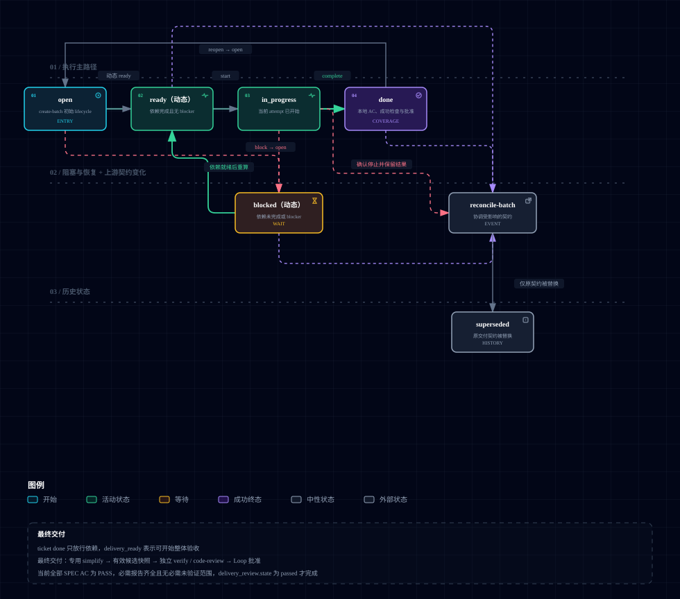

# Agent Skills

个人 Agent Skills 集合：Engineering 工作流（调研 → 需求 → 设计 → 实现 → 验证 → 审查）为核心，辅以后端生产实践、中文文档处理与全局会话/工具能力。面向 Claude Code、Codex、Cursor 等 Coding Agent，不绑定单一框架或 Runtime。

> 维护说明见 [`AGENTS.md`](./AGENTS.md)：Engineering Skills 处于收敛期，优先修正已有职责与入口，勿轻易新增全局工程 Skill。

## 安装

按你使用的 Agent 把本仓库中的 Skill 目录放到其 Skills 搜索路径即可；每个 Skill 是独立文件夹（内含 `SKILL.md`）。

常见做法：

1. **克隆或子模块**到本机，例如 `~/skills/calvingit-skills`。
2. **按需链接**需要的 Skill 目录到 Agent 的 skills 根目录（名称保持与文件夹名一致），例如：
   - Claude Code / 兼容实现：`~/.claude/skills/<skill-name> -> <repo>/<category>/<skill-name>`
   - 项目内：`.agents/skills/<skill-name>` 或工具文档指定的路径
3. **不要整库当作单个 Skill 安装**。`.agents/skills/verify-engineering` 仅用于维护本仓库，一般无需安装到其他项目。
4. 带 `scripts/` 的 Skill（如 `agent-tool`、`url-to-markdown`、`loop`）需本机具备其依赖（多为 Python 3 / Bash）；缺依赖时按该 Skill 正文说明处理。

仓库元数据（GitHub description / topics）需在 UI 或 `gh repo edit` 中单独设置；本 PR 无法通过文件提交完成。

## 目录

| 目录 | 内容 |
| --- | --- |
| [`engineering/`](./engineering/) | 调研、需求、设计、实现、验证、审查与维护（不绑定具体框架） |
| [`backend/`](./backend/) | 后端技术栈规范、生产实践与疑难问题处理 |
| [`documents/`](./documents/) | 文档转换、中文润色/术语与事实同步 |
| [`global/`](./global/) | 跨领域工具、上下文、会话辅助与学习 |
| [`docs/`](./docs/) | Engineering 使用总览、职责、Loop/Runtime、Kernel 与图示 |
| [`.agents/skills/`](./.agents/skills/) | 本仓库维护用验证 Skill（非对外安装包） |

许可见根目录 [`LICENSE`](./LICENSE)；第三方来源见 [`ATTRIBUTIONS.md`](./ATTRIBUTIONS.md)。

## 如何选用（Engineering 速查）

完整规则见 [`docs/engineering-skills.md`](./docs/engineering-skills.md)。按当前目标选入口，不必走完所有阶段：

| 当前状态 | 入口 |
| --- | --- |
| 需求/边界/验收未收敛 | [`grilling`](./engineering/grilling/SKILL.md) |
| 技术路径有跨会话迷雾 | [`wayfinding`](./engineering/wayfinding/SKILL.md) |
| 需要持久化规范 | [`to-spec`](./engineering/to-spec/SKILL.md) |
| 多模块共享设计约束 | [`high-level-design`](./engineering/high-level-design/SKILL.md) |
| 多执行单元与调度 | [`to-tickets`](./engineering/to-tickets/SKILL.md) → [`loop`](./engineering/loop/SKILL.md) |
| 单一范围、无执行图 | [`quick-implement`](./engineering/quick-implement/SKILL.md) |
| 缺可重复验证方法 | [`verification-setup`](./engineering/verification-setup/SKILL.md) |

## Engineering Skills

| Skill | 用途 |
| --- | --- |
| [`grilling`](./engineering/grilling/SKILL.md) | 访谈收敛尚未决定的需求与选择。 |
| [`wayfinding`](./engineering/wayfinding/SKILL.md) | 跨会话摸清依赖决策与探索地图。 |
| [`to-spec`](./engineering/to-spec/SKILL.md) | 把已确认需求写成规范性 SPEC。 |
| [`high-level-design`](./engineering/high-level-design/SKILL.md) | 对照 SPEC 与代码库产出/修订 HLD。 |
| [`to-tickets`](./engineering/to-tickets/SKILL.md) | 拆出可调度的交付 ticket 图。 |
| [`loop`](./engineering/loop/SKILL.md) | 推进 ticket 图：派发、证据与状态。 |
| [`quick-implement`](./engineering/quick-implement/SKILL.md) | 单一范围实现并收尾验证/审查。 |
| [`implement`](./engineering/implement/SKILL.md) | 在约定写范围内实现单张 ticket。 |
| [`tdd`](./engineering/tdd/SKILL.md) | 用红-绿-重构驱动单个行为。 |
| [`verify`](./engineering/verify/SKILL.md) | 独立按 AC 判断 PASS/FAIL/NOT VERIFIED。 |
| [`code-review`](./engineering/code-review/SKILL.md) | 审查缺陷、回归与无必要复杂度。 |
| [`simplify`](./engineering/simplify/SKILL.md) | 审查或去掉无当前职责的复杂度。 |
| [`debug`](./engineering/debug/SKILL.md) | 复现与诊断疑难缺陷（修复需授权）。 |
| [`test-audit`](./engineering/test-audit/SKILL.md) | 审计测试有效性与维护成本。 |
| [`project-setup`](./engineering/project-setup/SKILL.md) | 探测并持久化工程 Profile。 |
| [`verification-setup`](./engineering/verification-setup/SKILL.md) | 从仓库证据建立/刷新本地验证方法。 |
| [`domain-modeling`](./engineering/domain-modeling/SKILL.md) | 术语表与长期架构决策。 |
| [`codebase-design`](./engineering/codebase-design/SKILL.md) | 深模块、缝与依赖方向的共用词汇。 |
| [`review-architecture`](./engineering/review-architecture/SKILL.md) | 只读架构符合性审查与候选发现。 |
| [`challenge`](./engineering/challenge/SKILL.md) | 对已有方案做有边界对抗式审查。 |
| [`tech-research`](./engineering/tech-research/SKILL.md) | 基于证据的技术调研与选型建议。 |
| [`find-docs`](./engineering/find-docs/SKILL.md) | 按版本查找官方文档。 |
| [`how`](./engineering/how/SKILL.md) | 用户手动调用：解释当前代码如何运行。 |
| [`why`](./engineering/why/SKILL.md) | 用户手动调用：追查设计/限制成因。 |
| [`improve-agents-md`](./engineering/improve-agents-md/SKILL.md) | 创建或优化多工具适用的 AGENTS.md。 |
| [`fuck-my-shit-mountain`](./engineering/fuck-my-shit-mountain/SKILL.md) | **Project Audit**：多维证据审计；**仅显式调用**（目录名保持兼容，界面显示名 Project Audit）。 |

共享契约与状态工具：[`engineering/shared/`](./engineering/shared/)（含 `check.py`、ticket graph）。跨 Skill 导航另见 [`docs/`](./docs/)。

## Backend Skills

| Skill | 用途 |
| --- | --- |
| [`backend-development`](./backend/backend-development/SKILL.md) | 后端 API、服务、持久化、集成和后台处理的工程实践。 |
| [`api-contracts`](./backend/api-contracts/SKILL.md) | API 与事件 Schema 的契约一致性、兼容性和演进验证。 |
| [`event-driven-backend`](./backend/event-driven-backend/SKILL.md) | 消息、Webhook 与后台任务的投递、消费、重放和副作用检查。 |
| [`java-coding-guidelines`](./backend/java-coding-guidelines/SKILL.md) | Java 编写、修改和审查规范。 |
| [`mysql-best-practices`](./backend/mysql-best-practices/SKILL.md) | MySQL 生产问题诊断和高风险数据库变更审查。 |
| [`redis-best-practices`](./backend/redis-best-practices/SKILL.md) | Redis 建模、缓存与协调逻辑审查，运行诊断和恢复风险评估。 |
| [`mongodb-best-practices`](./backend/mongodb-best-practices/SKILL.md) | MongoDB 文档模型、查询索引、并发更新与运行变更审查。 |

`backend-development` 按改动边界加载检查项；`api-contracts` / `event-driven-backend` 分别管契约与异步副作用。实现、验证与审查流程仍由 Engineering Skills 负责。本仓库后端 Skill 的维护评估见 [verify-engineering](./.agents/skills/verify-engineering/SKILL.md)。

## Global Skills

| Skill | 用途 |
| --- | --- |
| [`context-audit`](./global/context-audit/SKILL.md) | 审查 Agent 上下文中的重复、冲突、过时内容和职责错位。 |
| [`explain-that`](./global/explain-that/SKILL.md) | 解释指定的局部内容，或用更少术语重述上一条完整回复。 |
| [`handoff`](./global/handoff/SKILL.md) | 整理可供下一次会话接续的交接文档。 |
| [`prompt-optimizer`](./global/prompt-optimizer/SKILL.md) | 优化任务提示词的目标、上下文、边界、输出和验证条件。 |
| [`show-me`](./global/show-me/SKILL.md) | 按理解难点选择最小必要的文本、表格、图示、图片或交互式 HTML。 |
| [`tavily-search`](./global/tavily-search/SKILL.md) | 为 Harness 提供基于 Tavily 的网页搜索。 |
| [`teach`](./global/teach/SKILL.md) | 组织连续的主题学习、参考资料和学习记录。 |
| [`agent-tool`](./global/agent-tool/SKILL.md) | 手动调用 Claude Code、Codex、Kimi、Pi 或 Grok 的统一 CLI 封装。 |

## Documents Skills

以文档或说明性文本本身为处理对象。工程决策、技术资料查询和会话状态管理仍由各自的 Skill 负责。

| Skill | 用途 |
| --- | --- |
| [`document-sync`](./documents/document-sync/SKILL.md) | 检查文档与当前实现和规范是否一致，只更新受影响内容。 |
| [`humanizer-zh`](./documents/humanizer-zh/SKILL.md) | 清理中文文本中的 AI 味、翻译腔和模板化表达。 |
| [`url-to-markdown`](./documents/url-to-markdown/SKILL.md) | 将公开网页转换为本地 Markdown 文件。 |
| [`terminology-zh`](./documents/terminology-zh/SKILL.md) | 审校中文技术术语并同步多载体表达。 |

## 文档与图示

- [使用总览与选择入口](./docs/engineering-skills.md)
- [职责与产物归属](./docs/engineering-responsibilities.md)
- [Loop 与 Runtime](./docs/loop-runtime.md)
- [Engineering Kernel](./docs/ENGINEERING_KERNEL.md)
- [本仓库验证方法](./.agents/skills/verify-engineering/SKILL.md)

