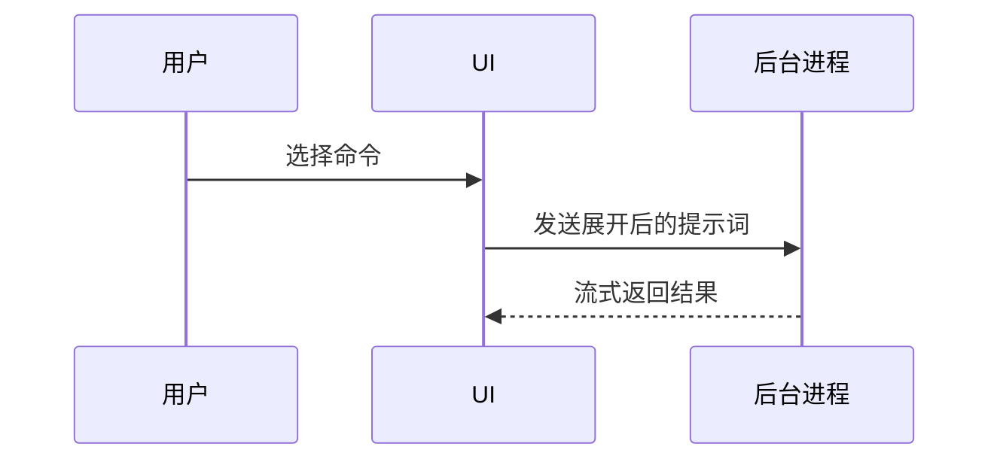

# 图示说明

用图示帮助用户理解当前话题。省去铺垫，文字保持简短，并选择足以说明关键问题的最小视图。

- 用伪代码展示逻辑或算法：

```text
on(save)
  if content is unchanged
    return cached result
  write new content
  return fresh result
```

- 用调用树展示运行时控制流：

```text
submitForm
  createSession
    persistPrompt
    launchAgent
  navigateToSession
```

- 用组件树展示界面结构，只保留相关的状态和模块边界：

```tsx
<SessionPage> (apps/example/src/routes/session.tsx)
  useSessionEvents()
  <SessionToolbar>
    <RunSkillButton> (packages/ui)
```

- 用浅层文件树展示文件职责或影响范围较大的重构：

```text
src/
├── commands/       # 解析用户操作
├── sessions/       # 维护会话状态
└── transport/      # 发送 API 请求
```

- 用 Mermaid 展示组件交互、控制流或数据流：



- 当重点是“改了什么”，且现有结构已经清楚时使用 `diff`。差异内容应与当前话题使用相同的结构。

组件变化：

```diff
 <SessionPage>
   useSessionEvents()
   <SessionToolbar>
+    <RunSkillButton />
   <SessionTimeline>
+    <SkillResultCard />
```

文件布局变化：

```diff
 src/
 ├── commands/
+│   └── show-me.ts       # 展开斜杠命令
 ├── sessions/
-└── transport.ts
+└── transport/
+    ├── client.ts
+    └── stream.ts
```

调用树或调用栈变化：

```diff
 submitForm
   createSession
     persistPrompt
+    expandSkillMention
     launchAgent
-  navigateToSession
+  navigateToSession
+    subscribeToEvents
```

状态或控制流变化：

```diff
 on(save)
-  write content
+  if content is unchanged
+    return cached result
+  write new content
+  invalidate cache
```

- 大部分内容都是新增、缺少上下文会让职责或顺序不清，或用户需要可直接复制的目标结构时，展示完整代码块：

```ts
function expandSkill(command: string): string {
  const skillName = command.slice(1)
  return `use the ${skillName} skill`
}
```

- 如果界面布局、状态对比或概念关系不适合用 Mermaid 表达，创建一个聚焦单一问题的 HTML 文件。根据内容选择图示、信息图或短幻灯片，并沿用产品的颜色、字体、间距和组件；使用真实标签与数据，同时适配桌面端和移动端。把文件保存在当前工作区，并通过运行环境支持的预览或文件链接交付。

将图示放在对应的简短说明旁边。只保留回答当前问题或比较当前选项所需的调用、文件、属性、状态和边界。

按需选择一种或少数组合形式，不要默认把所有形式都用一遍，以免信息过载。
