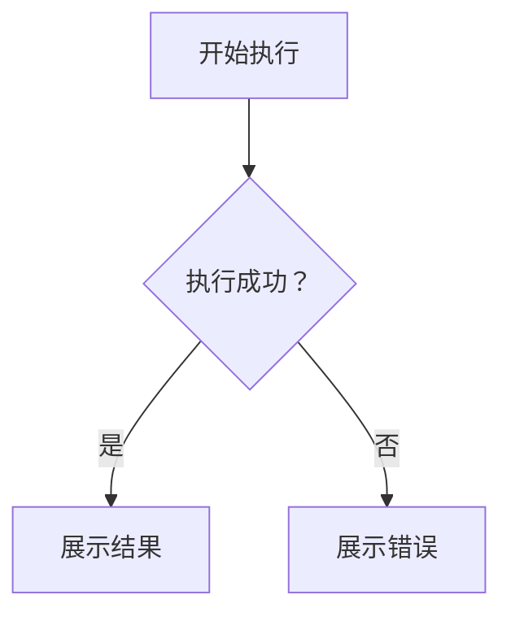

# 表达形式示例

需要具体写法时按目标形式参考；示例不是当前项目的真实结构。

## 文本与表格

简单判断直接用文本，不必创建文件：

> 表单校验通过后才能提交；有错误时保留输入，并标出需要修改的字段。

同一组维度需要逐项比较时使用表格。例如对比两种拟议写入策略：

| 策略 | 内容未变化 | 内容已变化 |
| --- | --- | --- |
| 每次写入 | 仍写入 | 写入 |
| 先比较内容 | 跳过写入 | 写入 |

## 代码与图示

用伪代码展示判断与动作：

```text
on(submit)
  if form is invalid
    show field errors
    return
  submit form
```

用调用树展示运行时调用顺序：

```text
submitForm
  createSession
    persistPrompt
    launchAgent
  navigateToSession
```

用组件树展示界面结构，只保留相关状态和模块边界：

```text
SessionPage — 会话页面
  useSessionEvents() — 订阅会话状态
  SessionToolbar — 会话操作
    RunSkillButton — 运行 Skill
```

用 Mermaid 展示分支或状态变化：



当重点是“改了什么”，且现有结构已经清楚时使用 `diff`。例如展示文件职责的拆分：

```diff
 src/
 ├── commands/
 ├── sessions/
-└── transport.ts
+└── transport/
+    ├── client.ts       # 发起请求
+    └── stream.ts       # 处理流式响应
```

同样可用 diff 展示组件、调用顺序或条件分支的变化。大部分内容都是新增、缺少上下文会影响理解，或需要可复制的目标结构时，展示完整的相关代码或树形结构。

## 图片与交互式 HTML

- 图片用于解释外观或空间布局，标明是设计概念还是实际截图。精确标签、连接关系和数据使用可检查的绘图工具。
- 用户需要探索参数变化时使用 HTML。例如用“请求数”和“单次成本”输入计算总成本，标明“示意模型，未包含固定费用与阶梯价格”。输入变化应改变结果。
- 模板用法见 [HTML 模板与内容稿](html-format.md)。[缓存保存示例稿](html-example.json) 展示总览、顺序讲解和条件切换；缓存有效性规则在该示例中完整呈现。
