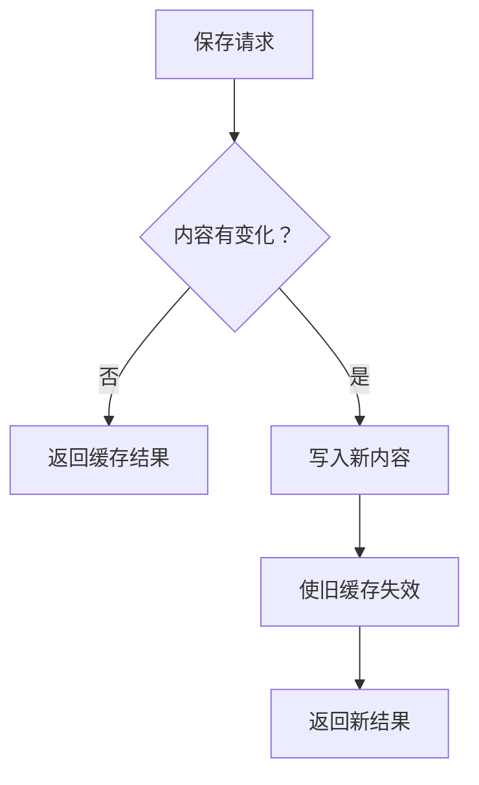

# 表达形式示例

需要具体示例时按目标形式参考；示例不是当前项目的真实结构。

## 文本与表格

简单判断直接用文本，不必创建文件。例如解释缓存命中时：

> 内容未变化时复用缓存，内容变化后重新写入并使旧缓存失效。

同一组维度需要逐项比较时使用表格。例如对比两种拟议保存策略：

| 策略 | 未变化的内容 | 变化后的内容 |
| --- | --- | --- |
| 每次写入 | 仍写入 | 写入 |
| 先检查变化 | 复用缓存 | 写入并使旧缓存失效 |

## 代码与图示

- 用伪代码展示逻辑或算法：

```text
on(save)
  if content is unchanged
    return cached result
  write new content
  return fresh result
```

- 用调用树展示运行时控制流：

```text
submitForm
  createSession
    persistPrompt
    launchAgent
  navigateToSession
```

- 用组件树展示界面结构，只保留相关的状态和模块边界：

```tsx
<SessionPage> (apps/example/src/routes/session.tsx)
  useSessionEvents()
  <SessionToolbar>
    <RunSkillButton> (packages/ui)
```

- 用浅层文件树展示文件职责或影响范围较大的重构：

```text
src/
├── commands/       # 解析用户操作
├── sessions/       # 维护会话状态
└── transport/      # 发送 API 请求
```

- 用 Mermaid 展示包含分支或状态变化的控制流：



- 当重点是“改了什么”，且现有结构已经清楚时使用 `diff`。差异内容应与当前话题使用相同的结构。

组件变化：

```diff
 <SessionPage>
   useSessionEvents()
   <SessionToolbar>
+    <RunSkillButton />
   <SessionTimeline>
+    <SkillResultCard />
```

文件布局变化：

```diff
 src/
 ├── commands/
+│   └── show-me.ts       # 展开斜杠命令
 ├── sessions/
-└── transport.ts
+└── transport/
+    ├── client.ts
+    └── stream.ts
```

调用树或调用栈变化：

```diff
 submitForm
   createSession
     persistPrompt
+    expandSkillMention
     launchAgent
-  navigateToSession
+  navigateToSession
+    subscribeToEvents
```

状态或控制流变化：

```diff
 on(save)
-  write content
+  if content is unchanged
+    return cached result
+  write new content
+  invalidate cache
```

- 大部分内容都是新增、缺少上下文会让职责或顺序不清，或用户需要可直接复制的目标结构时，展示完整代码块：

```ts
function expandSkill(command: string): string {
  const skillName = command.slice(1)
  return `use the ${skillName} skill`
}
```

## 图片与交互式 HTML

- 解释外观或空间布局时可使用图片，明确它是设计概念还是实际截图。涉及精确标签、连接关系或数据时使用可检查的绘图工具，不依赖生成式图片保证准确性。
- 用户需要探索参数变化时使用 HTML。例如解释一个简化的线性成本模型：提供“请求数”和“单次成本”输入，实时计算总成本，同时标明“示意模型，未包含固定费用与阶梯价格”。输入变化应改变结果，单纯显示说明的卡片不需要交互。
- 页面内标注假设和示意数据。交付前实际打开页面，检查初始结果、修改输入后的结果和窄屏布局，报告观察结果。不能运行浏览器时说明未验证，不能把静态检查称为交互验证。
